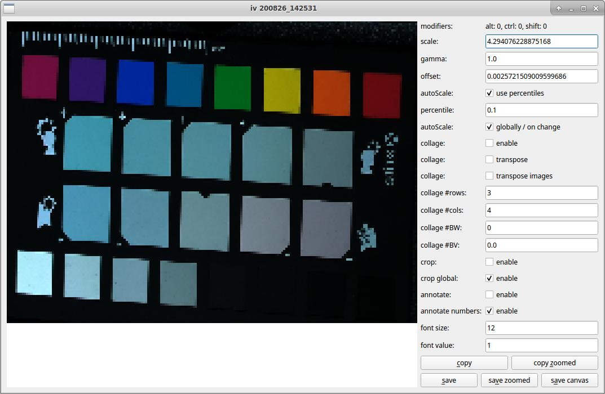
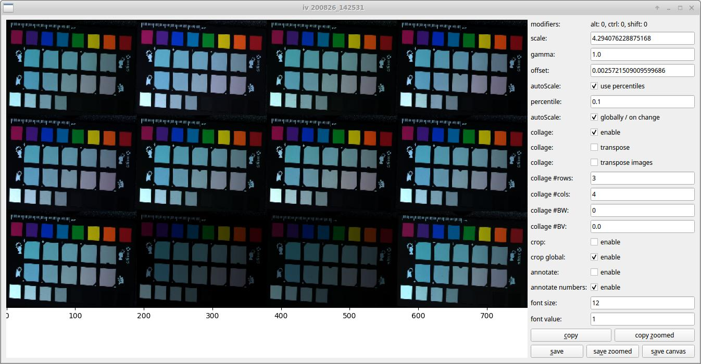
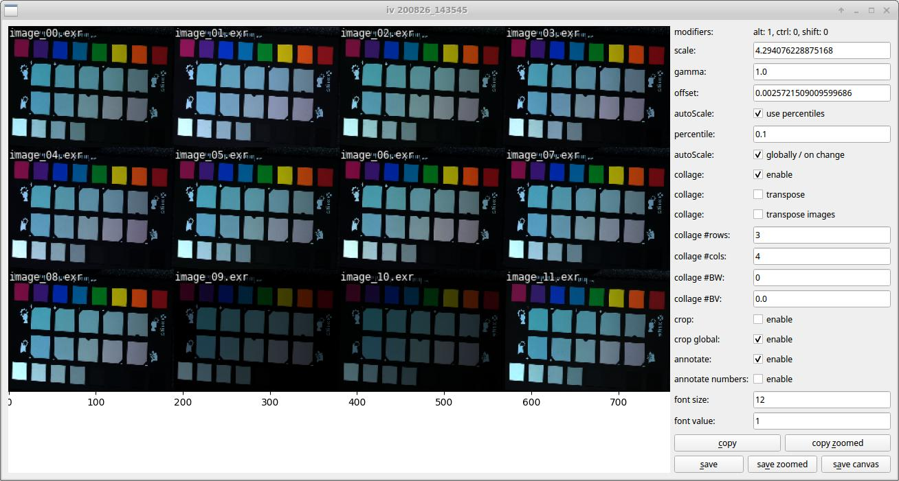

# pysmtb
python toolbox of (mostly) image-related helper / visualization functions 
```
from glob import glob

from pysmtb.iv import iv
from pysmtb.utils import read_exr

fns = glob('*.exr')
ims = [read_exr(fn)[0] for fn in fns]

iv(ims)
iv(ims, autoscale=False, scale=10, gamma=2)
iv(ims, collage=True)
```
 

```
# add labels onto each image
iv(ims, labels=fns, annotate=True, annotate_numbers=False)
```

