# pysmtb
python toolbox of image and rendering related helper / visualization functions

## Contents

* [Installation](#installation)
* [Interactive image viewer](#interactive-image-viewer)
* [Deferred rendering using PyEmbree](#deferred-rendering-using-pyembree)

## Installation

pysmtb is available on pypi.org and can be installed via pip in most environments:

```shell
pip install pysmtb
```


Alternatively, this Git repository can be cloned and an environment can be set up manually using conda:

```
conda env create -f environment.yml
conda activate pysmtb
```


## Interactive image viewer

`pysmtb.iv` provides an interactive (HDR) image viewer with automatic tonemapping:

```python
from glob import glob

from pysmtb.iv import iv
from pysmtb.utils import read_exr

fns = glob('*.exr')
ims = [read_exr(fn)[0] for fn in fns]

# by default, the viewer shows the first image and adjusts scale & offset to fit most of the dynamic range into the display range
iv(ims)
# tonemapping can be controlled
iv(ims, autoscale=False, scale=10, gamma=2)
# viewer can automatically arrange multiple images in a "collage"
iv(ims, collage=True)
```
 

```python
# add labels onto each image
iv(ims, labels=fns, annotate=True, annotate_numbers=False)
```


Collage mode can be further controlled, e.g., to pack images of different sizes more densely:

```python
# test tight collage mode
ims1 = [np.random.rand(25, 15, 3) for _ in range(10)]
ims2 = [np.random.rand(10, 12, 3) for _ in range(10)]
ims3 = [np.random.rand(15, 12, 1) for _ in range(8)]
coll = collage(ims1 + ims2 + ims3, bw=1, tight=False)
coll_tight = collage(ims1 + ims2 + ims3, bw=1, tight=True)
iv.iv(dict(tight=coll_tight, non_tight=coll), collage=True, collageBorderWidth=1, collageBorderValue=1, annotate=True)
```
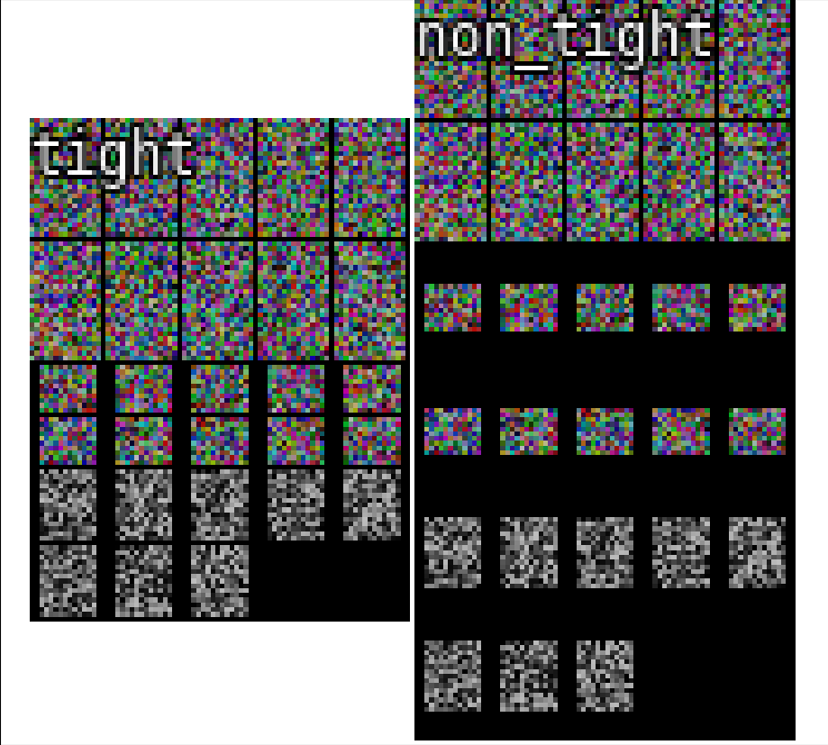


## Deferred rendering using PyEmbree

Under `pysmtb.geometry`, several utility functions for geometry generation and access are provided, along with functions that call PyEmbree to ray trace a scene, providing numpy ndarrays with, e.g., the 3D intersection points, light and view directions and so on.

```python
import numpy as np
from pysmtb.rendering import embree_render_deferred
from pysmtb.iv import iv
from pysmtb.utils import Dct, assign_masked

# create simple test geometry
sphere = create_unit_sphere(40)
cube = create_unit_cube()
# shift cube to the right
cube.vertices += np.r_[1.5, 0., 0.][None]

# visualize "scene"
sh = scatter3(sphere['vertices'], '.')
ax = sh.axes
scatter3(cube['vertices'], '.', axes=ax)
```


**visualization:** 3D scatter plot of scene objects

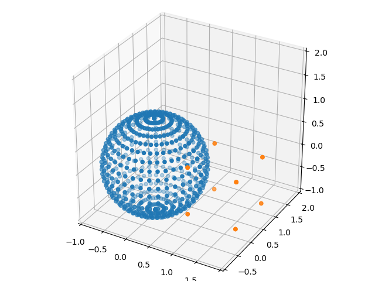

```python
# "scene" is represented simply as list of dictionaries, each with vertices, faces and uvs (texture coordinates)
meshes = []
meshes.append(sphere)
meshes.append(cube)

# set camera resolution
cam = Dct(res_x=384, res_y=256)

# render scene with 
buffers = embree_render_deferred(meshes, with_tangent_frames=True, cam=cam, auto_cam=True, light_position=np.r_[0., 10., 0.])
view_dirs_local = assign_masked(buffers['hit'], buffers['view_dirs_local'])
light_dirs_local = assign_masked(buffers['hit'], buffers['light_dirs_local'])

# visualize resulting local light and view directions
iv(view_dirs_local, light_dirs_local)
```


**visualization:** view and light vectors in tangent space

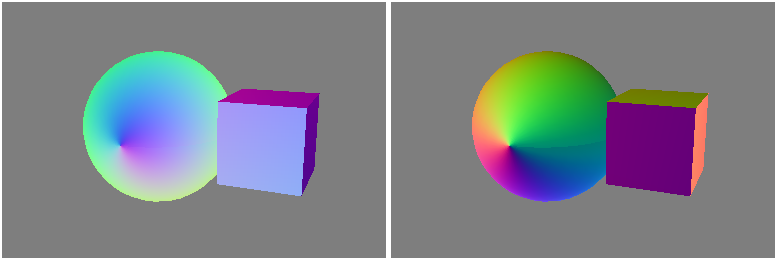


We can manually call the individual steps (render a few times under randomized camera positions):

```python

from pysmtb.rendering import normalize, create_unit_sphere, create_unit_cube,
    embree_intersect_scene, interpolate_vertex_attributes, get_local_dirs, get_bbox

buffers = []
for i in range(16):
    # manually render for a bunch of random camera positions
    cam = Dct(res_x=128, res_y=96)
    cam.cx = cam.res_x / 2.
    cam.cy = cam.res_y / 2.
    cam.position = np.mean(bbox, axis=0) + (bbox_diam / 2 + 10. * np.random.rand()) * normalize(np.random.rand(3) - 0.5)

    # set up EmbreeScene
    scene, cam = embree_create_scene(meshes=meshes, cam=cam, auto_cam=True, auto_cam_bbox=True,
                                     auto_cam_visualize=False)

    # trace rays
    buffers.append(embree_intersect_scene(scene=scene, cam=cam))

    # get per pixel interpolated vertex attributes (texture coordinates & tangent frames)
    buffers[-1] = interpolate_vertex_attributes(buffers[-1], meshes)

    # also compute global & local view directions
    view_dirs = get_local_dirs(buffers[-1], cam.position, normalized=True)
    buffers[-1]['view_dirs_local'] = view_dirs['dirs_local']
    buffers[-1]['view_dirs_global'] = view_dirs['dirs_global']

    # also compute global & local light directions
    light_dirs = get_local_dirs(buffers[-1], np.r_[0., 10., 0.], normalized=True)
    buffers[-1]['light_dirs_local'] = light_dirs['dirs_local']
    buffers[-1]['light_dirs_global'] = light_dirs['dirs_global']

    # num_hits x c --> res_y x res_x x c buffers
    for key in buffers[-1].keys():
        if key in ['hit']:
            continue
        buffers[-1][key] = assign_masked(buffers[-1]['hit'], buffers[-1][key])
```

**visualization:** the individual attributes

|                                                              |                                                              |                                                              |                                                              |                                                              |
| ------------------------------------------------------------ | ------------------------------------------------------------ | ------------------------------------------------------------ | ------------------------------------------------------------ | ------------------------------------------------------------ |
| hit mask 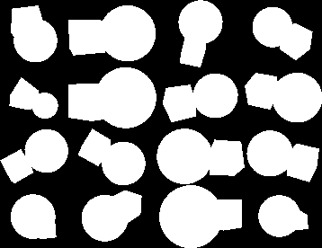                 | depth 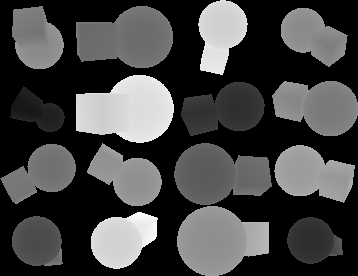                       | mesh IDs 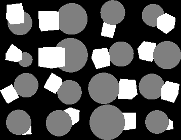                  | primitive (triangle) IDs 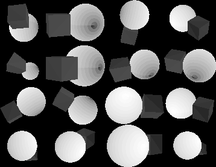  | barycentric coordinates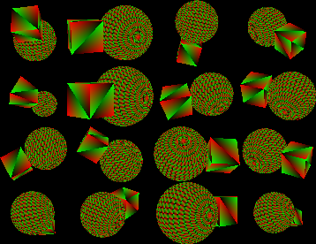 |
| 3D points 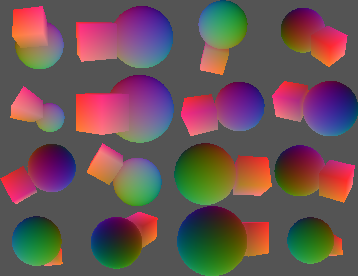                  | face normals 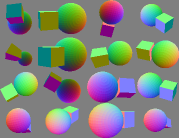         | vertex normals 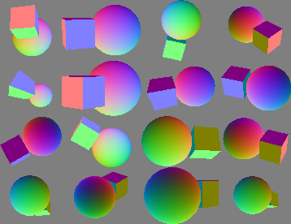     | vertex tangents 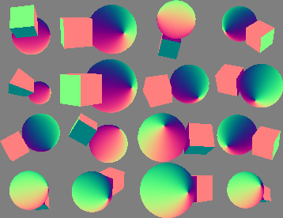   | vertex bitangents 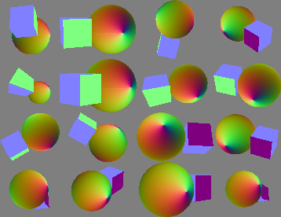 |
| view dirs (global) 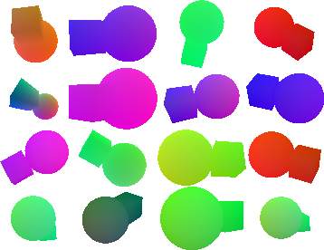 | view dirs (tangent space) 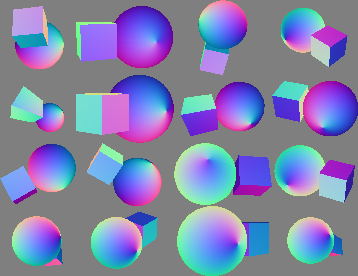 | light dirs (global)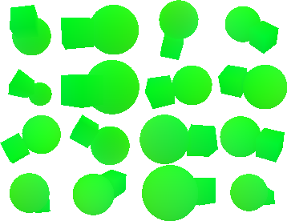 | light dirs (tangent space)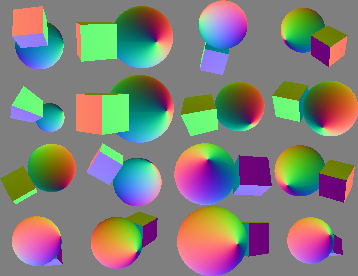 | texture coordinates 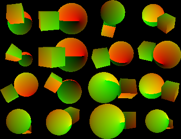 |


### Technical notes

Currently, meshes are represented as simple dictionaries with `vertices`, `faces`, `uvs` and optionally additional per-vertex attributes (e.g., tangents, bitangents and normals). This is due to a limitation in the `trimesh.Trimesh` class, namely that texture coordinates can only be specified per vertex and not per face, preventing proper unwrapping. Inputs of type `trimesh.Trimesh` or `trimesh.Scene` are therefore converted to dictionaries or lists of dictionaries with the above keys.

The most important function is `embree_render_deferred()`:

`embree_render_deferred()` produces inputs for deferred shading. It takes a list of meshes and a camera dictionary, as well as a point light position as input and returns `np.ndarray` buffers with all relevant geometric quantities per intersected pixel: 3D intersection points, interpolated vertex normals and tangents, normalized local and unnormalized global light and view directions.

For additional light sources, `get_local_dirs()` can be used with the buffers returned from `embree_render_deferred()` and a light position.

`embree_render_deferred()` calls the following functions: `embree_create_scene()`, `embree_intersect_scene()`, `interpolate_vertex_attributes()` and `get_local_dirs()`.

- `embree_create_scene()` constructs an `EmbreeScene` object, given the list of meshes. Camera parameters are either user-specified, or will be set automatically (random camera position facing the scene center). Unless explicitly specified, the camera focal length is automatically set so that the scene tightly fits onto the camera sensor. Unless explicitly disabled, it computes per-vertex tangent frames, using each mesh's texture coordinates.
- `embree_intersect_scene()` performs the actual ray tracing and returns a pixel mask with the camera's resolution indicating which pixels are hit, as well as buffers for all intersected pixels with the following attributes:
geometry and triangle IDs for each intersection, intersection depth (distance from camera), 3D intersection point,
barycentric coordinates within each triangle
- `interpolate_vertex_attributes()` computes per pixel texture coordinates and tangent frames by interpolating with the
barycentric coordinates returned from the `embree_intersect_scene()`


currently some relevant features are not yet implemented but will be added in the future:

- tracing shadow rays
- camera distortion model
- fallback tangent vector computation for meshes without texture coordinates

